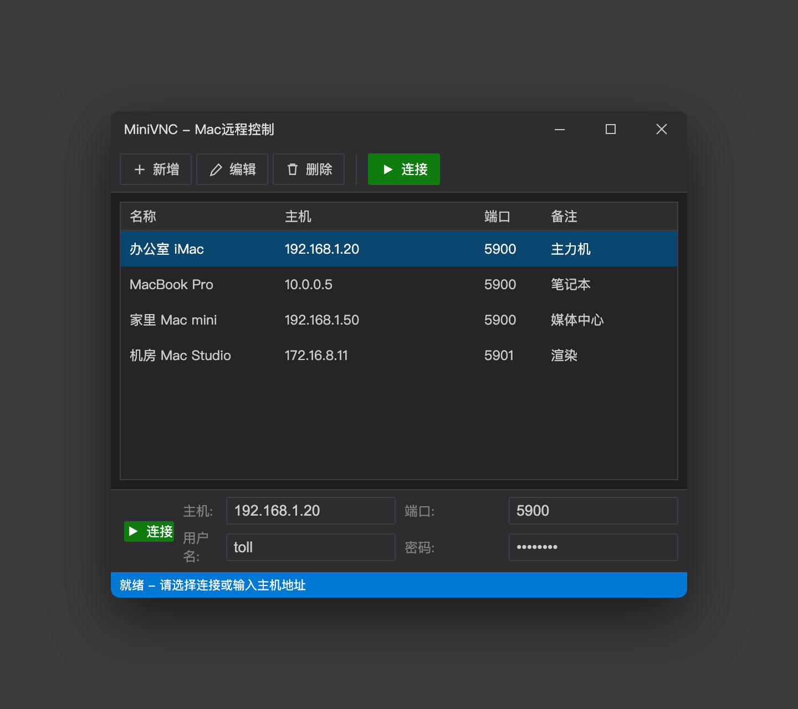
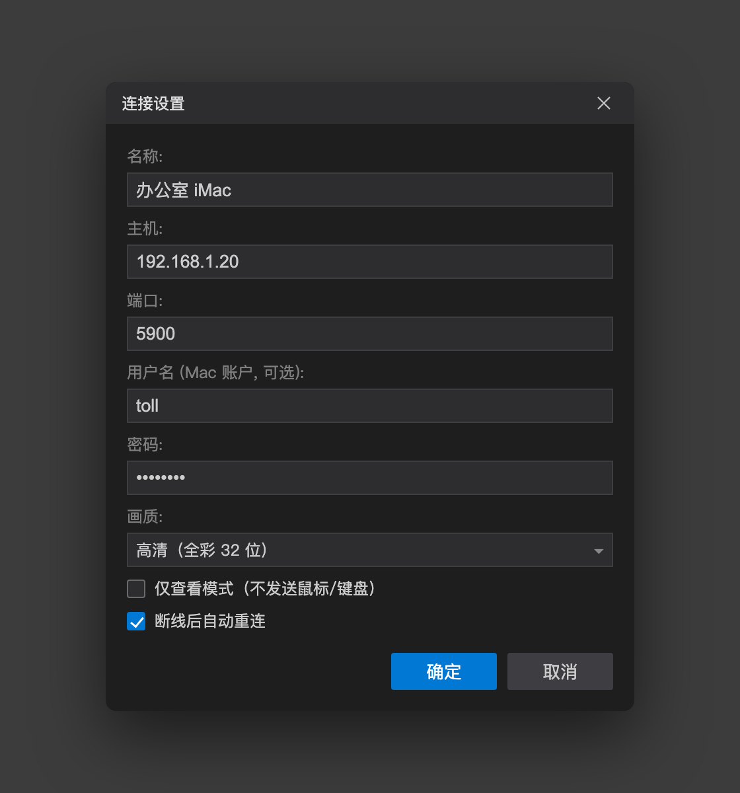
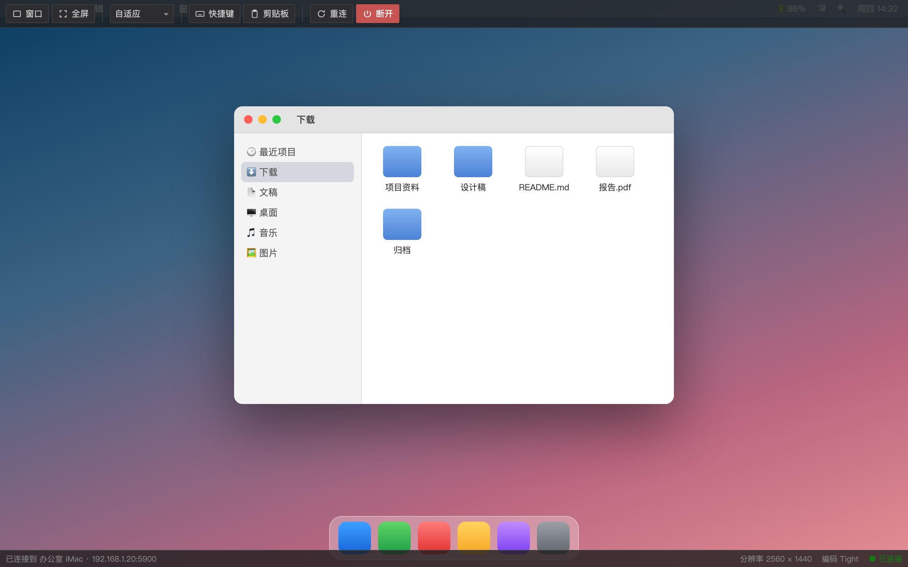
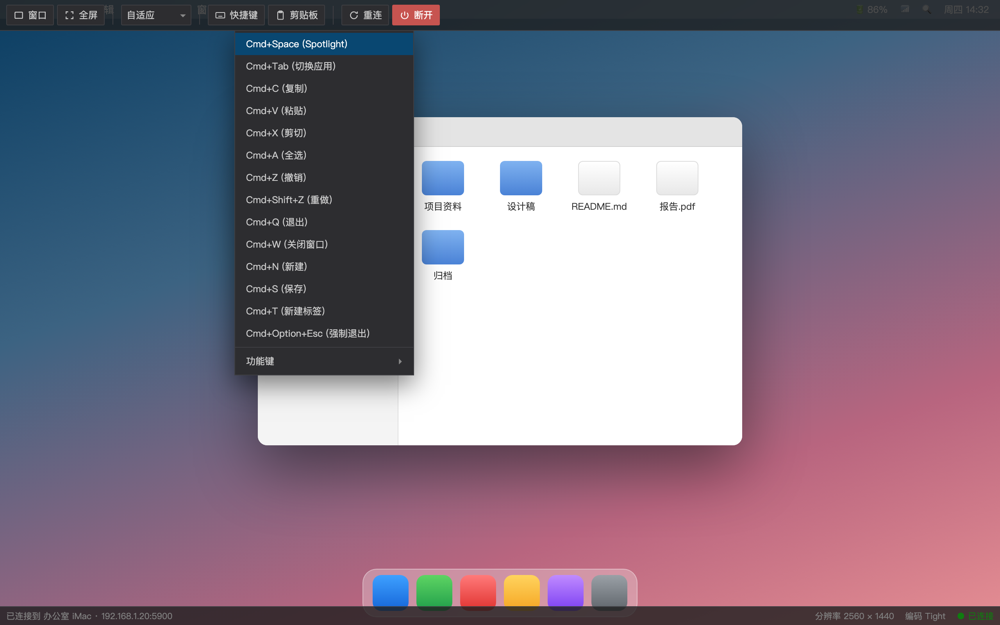

# MiniVNC — Windows免安装VNC远程控制工具

**用 Windows 控制 Mac 的轻量 VNC 客户端 —— 一个 exe，双击就用。**


专为 macOS「屏幕共享」做适配的 VNC 客户端。免安装、不提权、不装驱动、不写注册表——单文件自包含发布，
拷到任意 Windows 机器上双击即可运行，卸载就是删掉这个文件。

> **下载**：[Releases](../../releases/latest) 页面的 `MiniVNC.exe`（约 60 MB，已含 .NET 运行时，目标机无需预装任何东西）



---

## 亮点

**原生支持 macOS 的 Apple/ARD 认证** — 这是它和多数轻量 VNC 客户端最实际的区别。macOS 屏幕共享默认走
RFB 安全类型 30（Diffie-Hellman 密钥交换 + AES-128 加密凭据），只实现传统 DES 密码认证的客户端**连不上
默认配置的 Mac**。MiniVNC 完整实现了这套流程，用你的 **Mac 账户用户名 + 密码**直接登录，
密码也不受传统 VNC 的 8 字符截断限制。

**连续更新（ContinuousUpdates），每帧省一个往返** — 协商成功后由服务器主动推送增量帧，客户端不再"请求一帧、
等一帧"。在网络延迟明显的场景下，这一项直接把每帧的 RTT 等待砍掉。服务器不支持时自动回退到标准请求-应答，零副作用。

**远程光标本地渲染（Cursor 伪编码）** — 服务器把光标**形状**推过来，由本地绘制。鼠标移动零延迟跟手，
而且不会出现"服务器画的光标 + 本地光标"的重影。

**输入永不卡界面的写队列架构** — UI 线程只把鼠标/键盘事件**入队**（非阻塞），由独立的后台写线程串行发往 socket。
即使发送缓冲被填满，卡住的也只是那个写线程，界面照常响应。

**做过实测的网络层优化** — 读侧 64 KB 缓冲把一帧上万次 `recv` 系统调用压到几十次；每条客户端消息拼装后
一次性写出，在关闭 Nagle 的前提下，一次鼠标移动从 **4 个 TCP 包降到 1 个**。

**断线能自己恢复** — TCP keepalive（空闲 15s 探测、每 5s 一次、3 次判死）让半死连接在约 30 秒内被发现并触发
自动重连；重连带递增退避（避开 macOS 上一会话未释放的窗口期），并有"快速掉线保护"防止无限重连循环。

**分辨率跟随（DesktopSize）** — 在 Mac 上改了分辨率或切换显示器，画面自动按新尺寸重建，不用手动重连。

**中文剪贴板真的能用** — 收发按 UTF-8 处理（macOS 的实际行为），解码时先试严格 UTF-8、失败再回退 Latin-1，
中文和 Emoji 都能正确往返。剪贴板同步由系统事件驱动（`WM_CLIPBOARDUPDATE`），不做轮询，平时零开销。

**零第三方依赖** — 项目没有引用任何 NuGet 包。RFB 协议、Hextile/ZRLE 解码、DES、ARD 的 DH+AES 认证全部自己实现，
只用 .NET SDK 自带的类库。没有供应链风险，也不会因为某个包的源挂了而编译不过。

---

## 功能特性

| 功能 | 说明 |
| ------ | ------ |
| 免安装运行 | 单文件自包含，`asInvoker` 不请求管理员权限，配置只写 `%APPDATA%\MiniVNC` |
| 两种认证 | Apple/ARD（类型30，Mac 默认）与传统 VNC 密码（类型2，DES），自动选择 |
| 多连接管理 | 保存多个 Mac 连接配置，密码经 Windows DPAPI 加密存盘 |
| 完整远程控制 | 鼠标（含滚轮、中键）、键盘全转发，Win→Cmd / Alt→Option 映射，CapsLock 正确处理 |
| 主机地址灵活 | 支持 IP、域名、IPv6，以及 `host:port` 合写（自动拆分） |
| 画质可选 | 高清全彩 32 位 / 流畅 16 位（RGB565，带宽减半） |
| 多种编码 | ZRLE、Hextile、CopyRect、Raw，按优先级自动协商 |
| 全屏/窗口模式 | 无边框全屏与窗口模式切换，悬浮工具栏 |
| 自适应缩放 | 原始尺寸 / 适应窗口 / 拉伸填充 |
| 剪贴板同步 | 双向文本同步，事件驱动，支持中文与 Emoji |
| Mac 快捷键 | 一键发送 Cmd+Space、Cmd+Tab、Cmd+Q 等，以及 F1–F12 |
| 仅查看模式 | 只看不动，避免误操作 |
| 自动重连 | 断线后带退避自动恢复，可在设置中关闭 |
| 深色主题 | 与 macOS 风格协调的深色 UI |

---

## 快速开始

### 一、Mac 端：开启屏幕共享

1. **系统设置** → **通用** → **共享** → 打开 **屏幕共享**
2. 点旁边的 **(i)** → 选 **"仅这些用户"**，把你要用的账户加进去
3. 记下 Mac 的 IP：终端执行 `ipconfig getifaddr en0`（无线）或 `ipconfig getifaddr en1`（有线）

这样配置完，Mac 使用的是 **Apple/ARD 认证**——连接时**必须填写 Mac 账户用户名**。

<details>
<summary>可选：改用传统 VNC 密码认证</summary>

在屏幕共享设置里点 **"电脑设置..."** → 勾选 **"VNC 查看器可以使用密码控制屏幕"** → 设一个密码。

此时用户名留空、只填密码即可。注意这种方式**密码最多 8 个字符**（协议限制，超出部分被截断），
安全性也弱于 ARD，建议优先用上面的账户认证。

</details>

### 二、Windows 端：连接

**快速连接**——主界面底部填主机和端口，点连接：

| 字段 | 填什么 |
| ------ | ------ |
| 主机 | `192.168.1.100`，或域名，或 `192.168.1.100:5901` 这样合写 |
| 端口 | 默认 `5900` |
| 用户名 | **Mac 账户用户名**（ARD 认证必填；用 VNC 密码认证时留空） |
| 密码 | 对应的密码 |

**保存配置**——点工具栏 **新增**，可以额外设置画质、仅查看模式、自动重连：



### 三、远程会话



| 操作 | 说明 |
| ------ | ------ |
| 鼠标左/中/右键、滚轮 | 全部转发到 Mac |
| **Win 键** | 映射为 **Command (⌘)** |
| **Alt 键** | 映射为 **Option (⌥)** |
| **Ctrl+Alt+F** | 切换全屏 / 窗口 |
| **Ctrl+Alt+W** | 退出全屏，回到窗口模式 |
| **Ctrl+Alt+D** | 断开连接 |

> **ESC 不会退出全屏**——它被完整透传给 Mac。ESC 在 macOS 上是高频按键（取消、退出、vim），
> 拦截它会让人没法正常用。退出全屏请用 `Ctrl+Alt+F` / `Ctrl+Alt+W`，或把鼠标移到屏幕顶部调出工具栏。

**悬浮工具栏**（鼠标移到屏幕顶部）：窗口/全屏切换、缩放模式、发送 Mac 快捷键、剪贴板同步开关、重连、断开。



---

## 从外网访问

**推荐用 [Tailscale](https://tailscale.com/) 或 ZeroTier**：两端各装一次，之后在 MiniVNC 里直接填
`mac-mini.你的tailnet.ts.net:5900` 就行（主机名和 `host:port` 都是支持的）。NAT 穿透、端到端加密、
不需要公网 IP、不用在路由器上开任何端口。

**不要把 5900 端口直接映射到公网。** 需要明确知道的一点：**RFB 协议在认证之后不加密任何内容**——
屏幕画面、每一次击键（包括你在 Mac 上输入的密码）、剪贴板内容，在网络上都是明文。ARD 认证只加密凭据交换那一步。
所以：

- **局域网内**：直连没问题
- **跨网络**：一定要套隧道（Tailscale / WireGuard / SSH 端口转发），不要裸奔
- 屏幕共享请设置独立密码，不要复用 Apple ID 密码

---

## 编译

### 环境

- [.NET 9.0 SDK](https://dotnet.microsoft.com/download/dotnet/9.0) 或更高版本
- **可以在 macOS / Linux 上编译**（项目已设置 `EnableWindowsTargeting`），产物只能在 Windows 上运行

### 单文件发布

```bash
cd MiniVNC
dotnet publish -c Release -r win-x64 --self-contained \
  -p:PublishSingleFile=true \
  -p:EnableCompressionInSingleFile=true
```

产物：`bin/Release/net9.0-windows/win-x64/publish/MiniVNC.exe`，复制到任意位置即可运行。

只想验证能否编译（快很多）：

```bash
dotnet build -c Debug -p:SelfContained=false -p:PublishSingleFile=false -p:RuntimeIdentifier=
```

> WPF 不支持 Native AOT，也不支持完整 Trimming，因此采用「单文件 + 自包含」方案：
> 运行时随程序打包，目标机无需预装 .NET（代价是产物体积约 60 MB）。

推 `v*` 标签会触发 GitHub Actions 在 Windows 上构建并自动发布 Release。

### 测试

```bash
dotnet run --project tests/MiniVNC.Tests
```

108 项测试，全通过返回 0（CI 每次构建都会先跑一遍，失败即挡住发布）。测试项目刻意**不依赖 WPF**——
它链接协议、网络、编解码、认证这些无 UI 依赖的源文件编译成纯 `net9.0` 控制台程序，
所以在 macOS / Linux / Windows 上都能跑。同样零 NuGet 依赖，没有引入测试框架。

覆盖范围：

- **客户端报文线格式**——逐字节比对 RFB 规范（这些消息为了减少 TCP 包数是拼装后一次写出的，字节布局必须钉死）
- **读取分帧**——数据按小分片到达时，64KB 读缓冲与暂存区复用不能破坏"精确读 N 字节"
- **三种编码解码**——Raw（32/16bpp）、Hextile 四种瓦片形态、ZRLE 四种子编码，逐像素比对
- **帧缓冲裁剪**——越界矩形必须裁剪而非抛异常（抛异常会断开整条会话）
- **认证算法**——DES 的密码截断与分块；ARD 做完整的端到端验证：测试扮演服务器完成 DH 交换后
  把客户端密文解开，检查用户名和密码原样还原
- **完整会话**——一个假 VNC 服务器跑通握手→认证→初始化→消息循环，验证连续更新的启用与停用回退、
  DesktopSize 重建帧缓冲、剪贴板接收，以及断开耗时（曾经会空等满 2 秒）

---

## 项目结构

```text
MiniVNC/
├── App.xaml / .xaml.cs                 # 应用入口、深色主题、全局异常落盘
├── MainWindow.xaml / .xaml.cs          # 连接管理器 + 连接编辑对话框
├── RemoteSessionWindow.xaml / .xaml.cs # 远程会话窗口、重连、剪贴板监听
├── MiniVNC.csproj                      # 单文件自包含发布配置
├── app.manifest                        # Per-Monitor V2 DPI 感知、asInvoker
├── Core/
│   ├── VncClient.cs                    # 客户端主控：连接/认证/消息循环/写队列
│   ├── ConnectionSettings.cs           # 连接配置 + DPAPI 加密持久化
│   └── HostAddress.cs                  # 主机地址解析（host:port、IPv6）
├── Protocol/
│   ├── RfbProtocol.cs                  # RFB 协议状态机与报文读写
│   ├── Messages.cs                     # 像素格式、消息类型、编码常量
│   └── SecurityTypes.cs                # 安全类型枚举
├── Encodings/
│   ├── IEncoding.cs                    # 解码器接口
│   ├── ZrleEncoding.cs                 # ZRLE（持久 zlib 上下文 + CPIXEL）
│   ├── HextileEncoding.cs              # Hextile（16×16 瓦片）
│   ├── RawEncoding.cs                  # Raw
│   └── Framebuffer.cs                  # BGRA32 帧缓冲，读写加锁（CopyRect 在消息循环中内联处理）
├── Network/
│   └── VncStream.cs                    # TCP、大端序读写、64KB 读缓冲、keepalive
├── Input/
│   ├── KeyboardHandler.cs              # WPF Key → X11 keysym 映射
│   └── MouseHandler.cs                 # 本地坐标 → 远程坐标换算
├── Controls/
│   └── VncViewport.cs                  # 渲染画布、输入捕获、远程光标构建
├── Utils/
│   ├── AppleAuthenticator.cs           # Apple/ARD 认证（DH + AES-128）
│   └── DesEncryptor.cs                 # VNC 密码认证的 DES（位序反转）
└── Native/
    └── ClipboardHelper.cs              # 剪贴板读写（STA 处理）

tests/MiniVNC.Tests/                    # 测试套件（纯 net9.0，链接被测源文件，零依赖）
```

## 技术规格

| 项目 | 规格 |
| ------ | ------ |
| 语言 / 框架 | C# 13 / WPF (.NET 9)，`net9.0-windows` |
| RFB 协议版本 | 客户端固定使用 3.8 |
| 认证方式 | Apple/ARD（类型30，DH + AES-128）、VNC 密码（类型2，DES）、无认证（类型1） |
| 图像编码 | ZRLE、Hextile、CopyRect、Raw（按此优先级协商） |
| 伪编码 | Cursor(-239)、DesktopSize(-223)、ContinuousUpdates(-313) |
| 像素格式 | 32bpp 真彩 / 16bpp RGB565，统一解码为 BGRA32 |
| 第三方依赖 | 无（零 NuGet 包） |
| 发布模式 | 单文件 + 自包含，约 60 MB |
| DPI 支持 | Per-Monitor V2 |
| 权限要求 | `asInvoker`，不需要管理员 |

---

## 常见问题

### 连不上，提示需要 Apple 认证 / 认证失败

Mac 的屏幕共享默认使用 Apple/ARD 认证，**必须填写 Mac 账户用户名**（不是 Apple ID 邮箱，是本机账户短名）。
用户名留空会直接失败。如果你想只用密码连，参考上面「改用传统 VNC 密码认证」。

### 连接被重置 / 刚退出就重连失败

macOS 上一个屏幕共享会话的 `screensharingd` 需要十几秒到几十秒才释放，期间快速重连会被重置甚至限流。
MiniVNC 已内置递增退避重试（约 3/5/8/11 秒，共 ~27 秒），等它自己重试完即可。

### 域名填了连不上

域名解析失败（拼错、无 A 记录）会立刻报错而不是反复重试。检查拼写，或先在命令行 `ping 域名` 确认能解析。

### 画面卡顿

把连接设置里的画质改成 **流畅（16 位）**，带宽直接减半；确认走的是有线或 5GHz WiFi；
局域网内一般能跑得很顺，跨公网建议配合 Tailscale。

### 键盘没反应

点一下远程画面确保焦点在画布上；检查是否勾了 **仅查看模式**。

### 密码保存后换了台电脑就失效

密码用 Windows DPAPI 按**当前用户**加密存储，换机器或换用户账户都解不开——这是设计如此（避免明文落盘），
重新输入一次即可。

---

## 许可证

MIT License —— 可自由使用、修改和分发。详见 [LICENSE](LICENSE)。

变更记录见 [CHANGELOG.md](CHANGELOG.md)。
